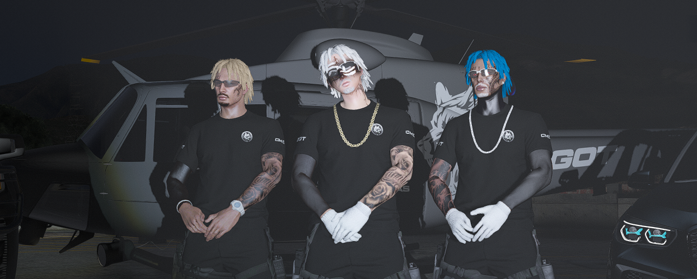

# Anúncios

<figure><figcaption></figcaption></figure>



### QTA AÇÕES

**TÍTULO:**\
**1ºBPM - CA INFORMA:**

O anúncio de QTA referente a alguma ação deve ser feito quando a polícia estiver desmaiada e sem contingente para o CÓDIGO 5. Qualquer oficial que estiver fora da situação pode fazer o anúncio e após o fim desse informe devemos voltar ao local e ajudar apenas os oficiais.

A partir deste informe, a polícia irá se retirar da QRU de disparos (CÓDIGO 5) e será prestado primeiros socorros apenas aos oficiais caídos/feridos no local. Após isso retornaremos normalmente nossas atividades militares.



### BAIXO CONTINGENTE

**1ºBPM - CA INFORMA:**

Alertamos a toda população do cidade alta que redobrem sua atenção e cuidado nas ruas, pois estamos com o contingente de oficiais reduzido e haverá uma espera maior no atendimento das ocorrências. Mantenham-se seguros!



### PACIFICAÇÃO

**1ºBPM - CA INFORMA:**

Comunicamos que, nos proximos 5 minutos apartir desde anuncio, será dada inicio a uma Operação Policial na Comunidade do(a) \<LOCAL DA OPERAÇÃO> visando a paz e a segurança dos moradores locais. Devido o risco de confronto, Informamos aos moradores que entrem em suas casas ou retirem-se do local pois toda presença no local será considerada hostil. A policia agradeçe a população.



### MODELOS DEMAIS AÇÕES

#### BANCO CENTRAL

**1ºBPM - CA INFORMA:**

A área do BANCO CENTRAL encontra-se restrita, pois está sob atividade criminosa, evitem passar próximo ao local, devido ao alto risco de disparos. ESTE SERÁ O ÚNICO AVISO! Não se aproximem!

***

#### PALETO

**1ºBPM - CA INFORMA:**

A área do BANCO DE PALETO encontra-se restrita, pois está sob atividade criminosa, evitem passar próximo ao local, devido ao alto risco de disparos. ESTE SERÁ O ÚNICO AVISO! Não se aproximem!

***

#### INVADER

**1ºBPM - CA INFORMA:**

A área do BANCO FLEECA LIFE INVADER encontra-se restrita, pois está sob atividade criminosa, evitem passar próximo ao local, devido ao alto risco de disparos. ESTE SERÁ O ÚNICO AVISO! Não se aproximem!

***

#### SHOPPING

**1ºBPM - CA INFORMA:**

A área do BANCO FLEECA DO SHOPPING encontra-se restrita, pois está sob atividade criminosa, evitem passar próximo ao local, devido ao alto risco de disparos. ESTE SERÁ O ÚNICO AVISO! Não se aproximem!

***

#### CHAVES

**1ºBPM - CA INFORMA:**

A área do BANCO FLEECA VILA DO CHAVES encontra-se restrita, pois está sob atividade criminosa, evitem passar próximo ao local, devido ao alto risco de disparos. ESTE SERÁ O ÚNICO AVISO! Não se aproximem!

***

#### PRAIA

**1ºBPM - CA INFORMA:**

A área do BANCO FLEECA DA PRAIA encontra-se restrita, pois está sob atividade criminosa, evitem passar próximo ao local, devido ao alto risco de disparos. ESTE SERÁ O ÚNICO AVISO! Não se aproximem!

***

#### ROTA 68

**1ºBPM - CA INFORMA:**

A área do BANCO FLEECA DA ROTA 68 encontra-se restrita, pois está sob atividade criminosa, evitem passar próximo ao local, devido ao alto risco de disparos. ESTE SERÁ O ÚNICO AVISO! Não se aproximem!

***

#### JOALHERIA

**1ºBPM - CA INFORMA:**

A área da JOALHERIA encontra-se restrita, pois está sob atividade criminosa, evitem passar próximo ao local, devido ao alto risco de disparos. ESTE SERÁ O ÚNICO AVISO! Não se aproximem!


