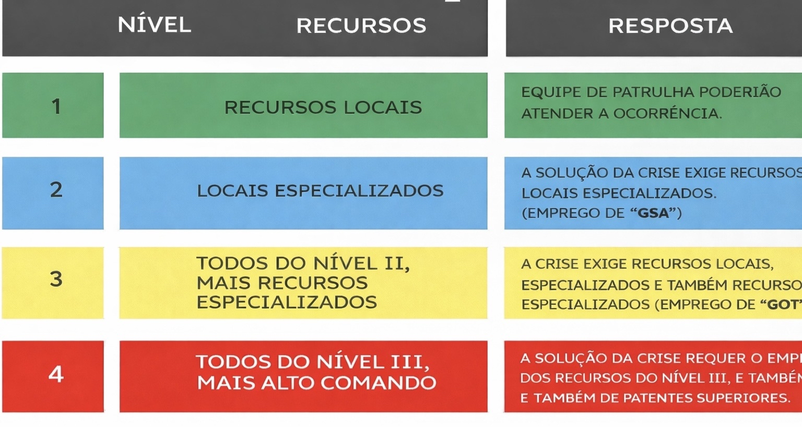

# Negociação

### Introdução

O curso de gerenciamento de crises é essencial para oficiais que desejam aprender a lidar com situações de alta tensão, como seqüestros e assaltos. Durante o curso, os participantes aprenderão técnicas e procedimentos de negociação que permitirão a resolução pacífica dessas situações. É importante ressaltar que o gerenciamento de crises requer uma abordagem cuidadosa e estratégica, e os participantes serão capacitados a avaliar cada situação individualmente e a agir de forma a garantir a segurança das vítimas, reféns e também dos próprios policiais.

O curso abrange desde a primeira aproximação até a quebra de negociação, passando pela conduta correta durante a negociação e quais pontos podem ou não serem negociados com os criminosos. Com o conhecimento adquirido durante o curso, os oficiais estarão mais preparados para gerenciar situações críticas e minimizar os riscos envolvidos.

A patente mais alta é a autoridade máxima para todas as ações no local da crise, decidindo também a estratégia a ser utilizada para a solução do evento crítico. Este profissional revisa e dá a última palavra sobre todos os planos que terão impacto sobre a área da crise, sob o constante crivo dos critérios de ação, necessidade, aceitabilidade e validade do risco. Também assegura uma coordenação com o seu substituto, na execução das tarefas desde, quando necessário.\
\
O Negociador, naturalmente, é a essência de uma equipe de resposta a um evento crítico. O modelo preferido é ter um negociador primário e um secundário. O negociador secundário assume o controle se o negociador principal não conseguir estabelecer comunicação suficiente com o indivíduo, se houver barreiras durante a negociação ou se não conseguir chegar a um acordo bom para ambos lados, ou até mesmo se o negociador principal precisar de uma pausa após muito tempo de conversação.\
\
Superada a fase da pré-confrontação, a fase da resposta imediata é aquela em que a organização policial reage ao evento crítico. Em termos práticos, essa resposta ativa consiste em se dirigir até o local da ocorrência e providenciar para que a ação dos perpetradores da crise seja controlada, o local seja isolado e as negociações sejam iniciadas. A primeira intervenção eficaz tem provado que a maioria dos sucessos no gerenciamento de crises ocorre em razão de respostas imediatas eficientes, em que, principalmente, se atentou para um perfeito isolamento do ponto crítico.\
\
**Ocorrência**

* Níveis de resposta.\
  Para cada grau de risco a doutrina estabelece um nível de resposta da agência policial. Esse nível de resposta eleva-se gradativamente na escala hierárquica da entidade, na medida em que cresce a proporção e o risco da crise a ser enfrentada. Os níveis de resposta adequados para cada grau de risco ou ameaça também são quatro: 

<figure><figcaption></figcaption></figure>

## Gerenciamento

* Conter a crise:\
  Evitar que a crise se alastre, ou seja, impedir que os criminosos aumentem o número de reféns, amplifique a área sob seu domínio, conquistem posições mais guarnecidas, tenham acesso a mais armamento, entre outras. 
* Isolamento da área:\
  A ação de isolar o ponto crítico, que progride quase que ao mesmo tempo da contenção da crise, consiste em delimitar o local da ocorrência, interrompendo todo e qualquer contato dos tomadores de reféns (se houver) com o mundo exterior. Essa ação tem como objetivo principal obter o controle total da situação por parte da polícia  \
  \
  Varredura do local:\
  Também conhecido por código 6, o procedimento de ter aeronaves e viaturas fazendo a varredura de todo o perímetro da crise é essencial e essa ordem deve vir de superiores ou operadores da GOT, que deverão organizar e indicar qual a extensão que o procedimento deverá ser feito. Os policiais deverão obrigatoriamente realizar a varredura.\
  \
  **COMUNICAÇÃO**\
  \
  A comunicação é um elemento fundamental no gerenciamento de crises, pois ajuda a evitar problemas e a estabelecer um diálogo com a polícia e os bandidos.&#x20;

## Como se comunicar em uma crise?

* ## Ser transparente e honesto.
* ## Reconhecer as dificuldades e apresentar soluções realistas.
* ## Comunicar-se de forma clara e direta.
* ## Evitar o uso de palavras alarmistas ou negativas.
* ## Definir os canais de comunicação.
* ## Identificar os porta-vozes autorizados.

## Como antecipar uma crise?&#x20;

* ## Identificar a equipe de gerenciamento de crises.
* ## Conduzir uma avaliação de risco.
* ## Criar uma cadeia de comando.
* ## Implementar ferramentas de monitoramento.
* Acompanhar a crise de modo ativo. 
  ------------------------------------------------

Exemplo de como deve ser feita a negociação:  Chegar na Joalheria, identificar o negociador, sinalizar uma freqüência de rádio e informar ao grupo especializado (GOT) para iniciar as tratativas da negociação.\
\
Caso não tenha GOT em QRV, a maior patente assumirá o papel e deverá seguir as instruções:

* •  Um negociador entra na rádio para ficar negociando com os bandidos, enquanto  o negociador secundário (se houver) passa o informe via CP pedindo a formação para a ação.\
  \
  Observação: Não necessariamente precisa negociar no local, pode pegar a freqüência do rádio e manter próximo para extração de reféns.\
  \
  • Durante a negociação é obrigatório saber se no local há reféns e a quantidade e o estado de saúde dos mesmos para poder iniciar as tratativas para retirá-los o quanto antes do local.\
  \
  Lembrando: Uma negociação sempre será uma via de mão dupla, onde tem de ter o bom senso e não pode em hipótese alguma ser tratada como uma ‘’exigência’’ por parte do outro lado.\
  \
  •  Quando concluída, sair do local para ir na DP realizar a escalação, mantendo o perímetro aberto no local.

**RESGATE DO REFÉM**\
O resgate do refém ocorre após a negociação ser feita e concluída, o oficial se dirige até o local, busca o refém e é extremamente necessário revistar o refém, pois ele pode ter algo ilegal na mochila ou até mesmo o dinheiro da ação. Após isso, o oficial deve verificar se o refém está precisando de algo, como comida ou água.\
\
Observação: Caso encontre algo de ilícito com o refém, o mesmo deve ser algemado e encaminhado até a DP para ser efetuada a prisão do mesmo.

\
**INTERVENÇÃO**\
A intervenção em uma ação deve ocorrer quando os bandidos matarem os reféns durante uma negociação, sendo assim sempre será avisado via CP ou rádio padrão da polícia informando que será feita a intervenção do local com o contingente máximo.\
\
A intervenção também pode ocorrer quando no meio da ação houver uma quebra de negociação (os bandidos não cumprirem com o que foi negociado)\
\
Exemplo: Os bandidos negociaram que a ação seria teti-chão, e no meio da ação eles estavam em cima de prédios disparando contra os oficiais.\
\
Sendo assim os oficiais devem voltar para a rádio padrão da polícia (polícia) e informar o ocorrido também via CP para liberar o contingente máximo para o ocorrido.\
\
Observação: Sempre quando houver intervenções, é obrigatório todos os oficiais em QRV sem exceção, darem QTA de todas as QRU’s e se direcionarem ao local para prestar apoio. 
