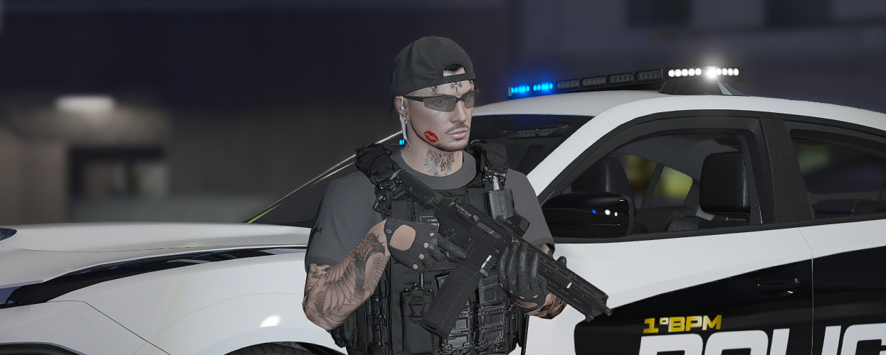

# Arsenal

## Conheça nosso arsenal completo: armas, munições, attachments e demais equipamentos.

#### <mark style="color:$primary;">**ARSENAL E DEPÓSITO DE ITENS: ANDAR -1**</mark>

<figure><figcaption></figcaption></figure>

<figure><figcaption></figcaption></figure>

#### <mark style="color:$primary;">Baú Pessoal:</mark>

<figure><figcaption></figcaption></figure>


Não esqueça de equipar: COLETE, ALGEMA e TABLET!


>)

>)

#### <mark style="color:$primary;">Evidência:</mark>

A Evidência é utilizada para armazenar os pertences dos indivíduos durante a ocorrência, garantindo a organização e o registro correto dos itens apreendidos.  \
\
<mark style="color:$danger;">**ATENÇÃO:**</mark>**&#x20;Após arrastar um item para o saco de Evidências, não será possível removê-lo.** Em caso de erro (inserção de item indevido):

* O Oficial deverá ressarcir o indivíduo pelo item
* Poderá sofrer penalidades administrativas conforme a situação

**Ex:** Evidência Comum. Ex: Evidência com Conteúdo > (OBS: Não esquecer de inserir o nº da evidência no boletim de ocorrência) 

<mark style="color:orange;">**Evidência comum:**</mark>&#x20;

<figure><figcaption></figcaption></figure>

<mark style="color:orange;">**Evidência com conteúdo:**</mark>&#x20;

<figure><figcaption></figcaption></figure>

<mark style="color:$primary;">**Analisador Residual:**</mark>

1.  Utilizado em ocorrências onde teve uma suspeita de um indivíduo que manuseou/consumiu algum tipo de ENTORPECENTE, C4 ou LOCKPICK 

    
<figure><figcaption></figcaption></figure>

\
Exemplos onde o resultado é **Positivo** \
.png>)\
.png>)\
Exemplos onde o resultado é **Negativo**\
.png>) 

<mark style="color:$primary;">**Identificador de Pólvora:**</mark>

Utilizado em ocorrências onde teve uma suspeita de um disparo de arma de fogo ilegal\
.png>)\
\
Exemplos onde o resultado é **Positivo**\
.png>)\
\
Exemplos onde o resultado é **Negativo**\
.png>)

<mark style="color:$primary;">ARMAS e EQUIPAMENTOS</mark>

Nossos armamentos e equipamentos são dividios entre PATENTE e CURSO DE CAPACITAÇÃO para uso operacional.

Para <mark style="color:$success;">RECRUTAS:</mark>\ <mark style="color:$success;">- 1x Glock</mark>\ <mark style="color:$success;">- 250x Munições de Pistola</mark>\ <mark style="color:$success;">-&#x20;
2x Colete;</mark>
\ <mark style="color:$success;">- 1x Algema;</mark>
\ <mark style="color:$success;">- 1x Tablet Policial;</mark>
\ <mark style="color:$success;">- 1x Taser;</mark>
\ <mark style="color:$success;">- 1x Cassetete ou taco;</mark>
\ <mark style="color:$success;">- 10x Sacos de Evidências.</mark>\
\
Para <mark style="color:$warning;">Soldados+:</mark>\ <mark style="color:$warning;">- 1x Glock OU Five Seven (ESCOLHA APENAS UMA)</mark>
\ <mark style="color:$warning;">- 250x Munições de Pistola;</mark>
\ <mark style="color:$warning;">- 1x M4A1</mark>
\ <mark style="color:$warning;">- 250x Munições de Fuzil + 250 Extras totalizando 500;</mark>
\ <mark style="color:$warning;">- 2x Colete;</mark>
\ <mark style="color:$warning;">- 1x Algema;</mark>
\ <mark style="color:$warning;">- 1x Tablet Policial;</mark>
\ <mark style="color:$warning;">- 1x Taser;</mark>
\ <mark style="color:$warning;">- 1x Cassetete ou taco;</mark>
\ <mark style="color:$warning;">- 1x Analisador Residual e de Polvora;</mark>
\ <mark style="color:$warning;">- 1x Chave Mestre;</mark>
\ <mark style="color:$warning;">- 10x Sacos de Evidências.</mark>

#### <mark style="color:$primary;">Attachs:</mark>

Cada tipo de armamento tem seu respectivo tipo de munição e o seu KIT de ATTACHS (utilizados para melhor desempenho no momento do combate).\
\
.png>)

Compre o ATTACH referente ao seu armamento e equipe da seguinte forma:

<figure><figcaption></figcaption></figure>

<mark style="color:$primary;">**CURSO DE CAPACITAÇÃO DE ARMAMENTO**</mark>

**Este curso tem como base verificar suas capacidades e habilidades necessárias para utlização de um fuzil de melhor desempenho.**\
**A aprovação neste curso lhe capacita para a utilização dos demais fuzis disponiveis no arsenal&#x20;**<mark style="color:red;">**COM EXCEÇÃO DE:**</mark>\ <mark style="color:red;">**- MTAR**</mark>\ <mark style="color:red;">**- G3MK2**</mark>\ <mark style="color:red;">**- APPISTOL.**</mark>


<mark style="color:orange;">OBS: Caso você tenha skin de algumas delas, é liberada a utilização, desde que seja previamente informado via DISCORD abrindo uma corregedoria interna com uma print sua com a skin em mãos.</mark>


<mark style="color:$primary;">**Quantidade máxima por item:**</mark>

1. Evite problemas com revistas surpresas!
2. 250 munições equipadas + máximo de 250 munições por armamento na mochila (500 no TOTAL) (exceto GRA e GOT que podem possuir mais)
3. Máximo de 2 coletes na mochila. 
