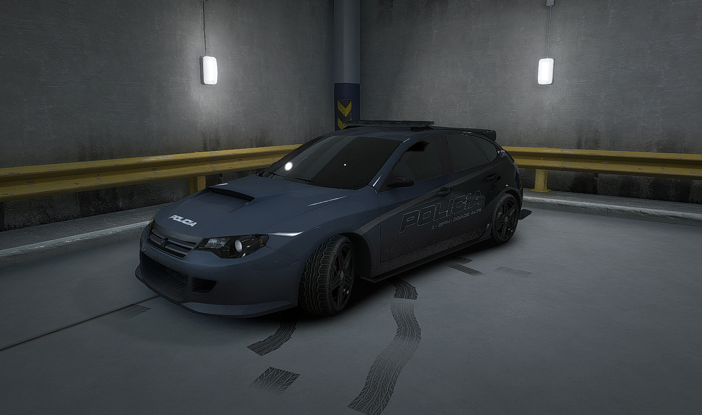
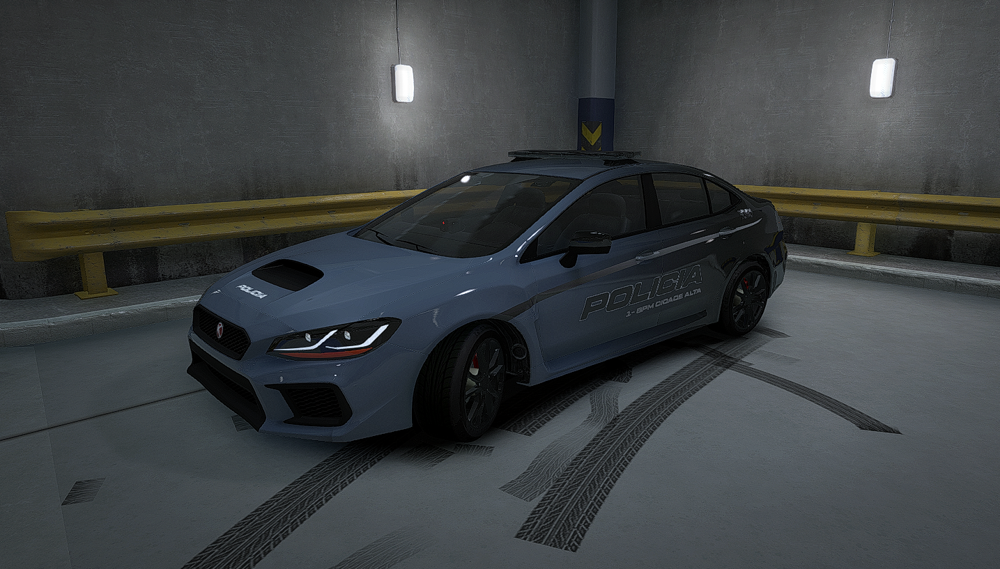
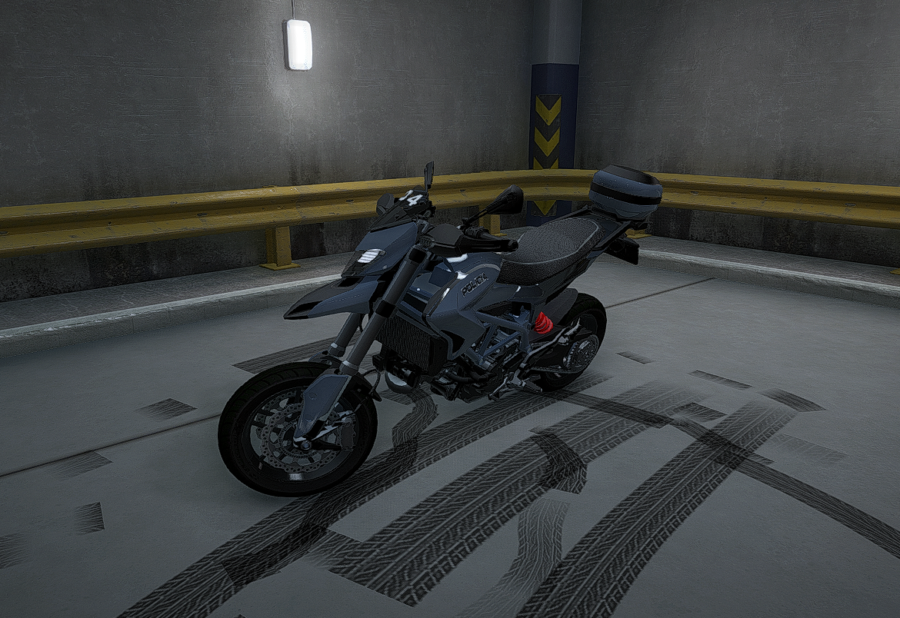
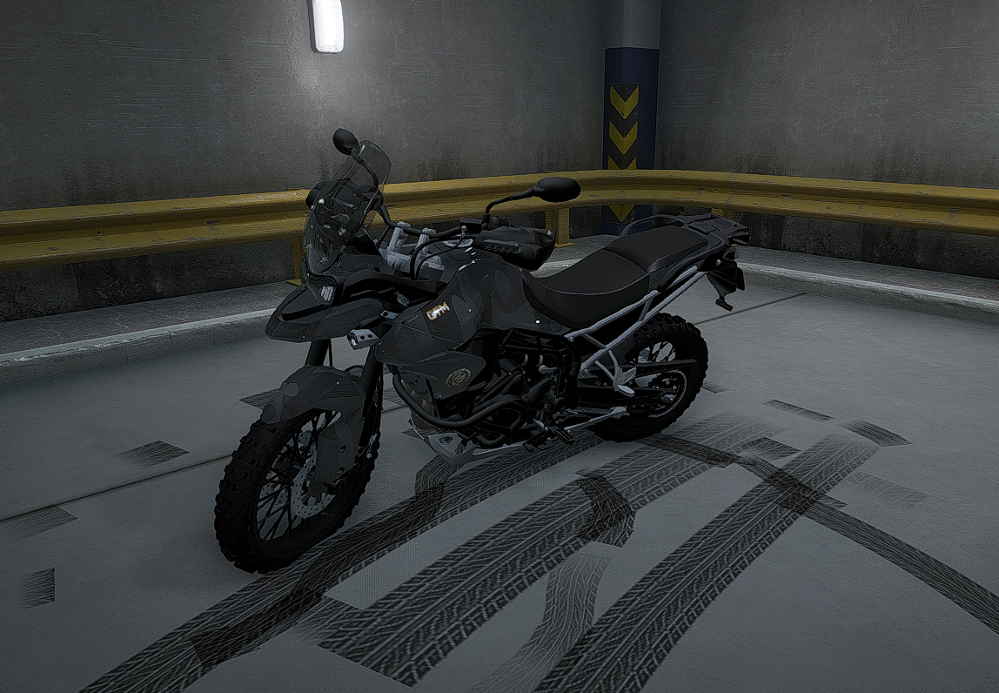
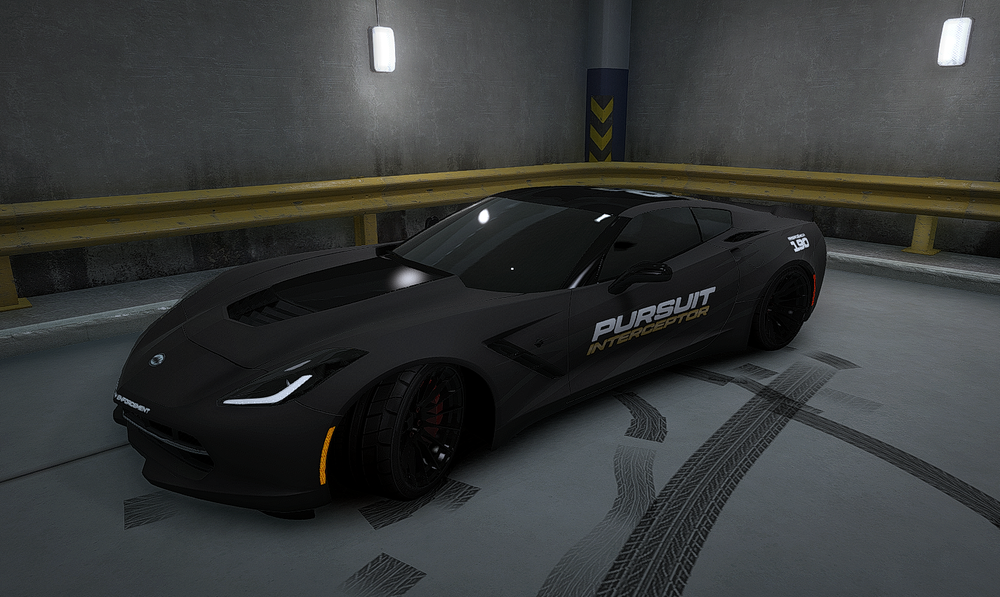
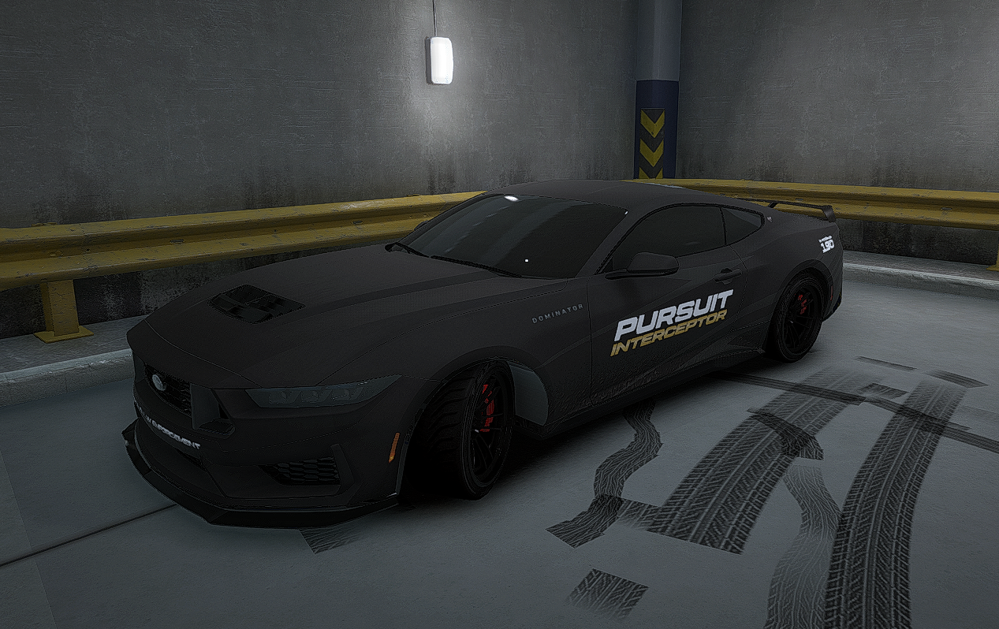
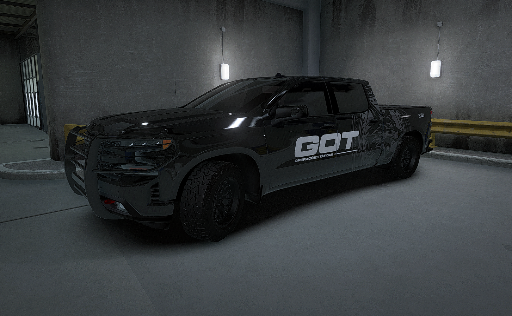
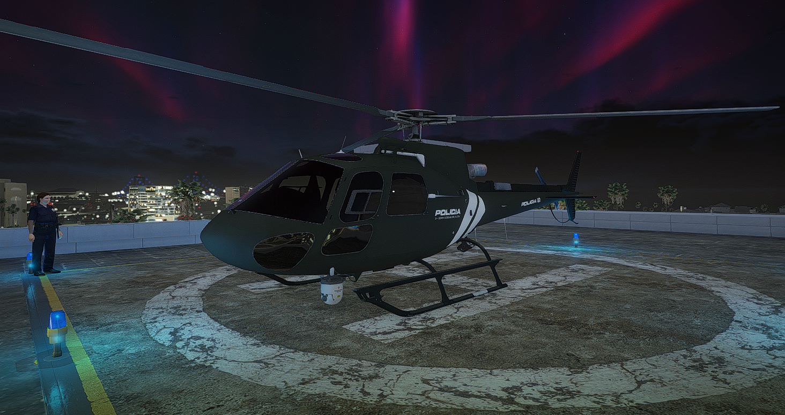
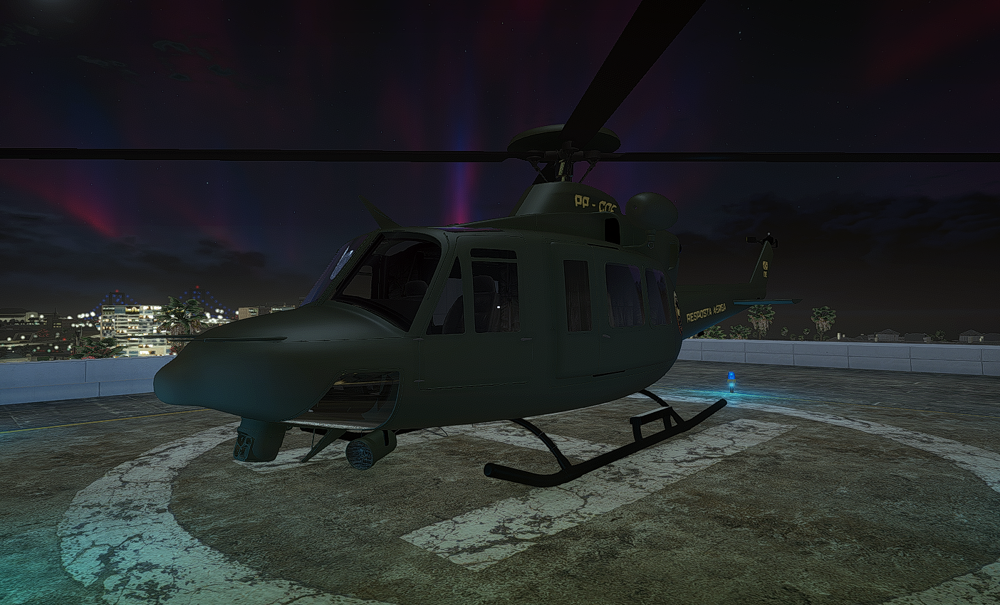

# Viaturas

* Todas as viaturas devem estar com sua devida BAGDE (Verificar na Planilha da Policia);
* É obrigatório a utilização da livery de policia;
* É permitido apenas rodas na cor PRETA e SEM ESCRITA;
* Bodybarts e Bodykits são permitidos;
* Obrigatório o uso do GIROFLEX em todas as viaturas; (Salvo Sargentos ou patentes superiores onde é opcional a utilização)

&#x20;**OBS:** Todas as viaturas da Policia utilizadas por RPM devem estar no padrão policial descrito acima, incluindo blindados.

### POL. RS (VIATURA PADRÃO)

<figure><figcaption></figcaption></figure>

### POL. SULTAN (LIBERAÇÃO VIA CERTIFICADO)

<figure><figcaption></figcaption></figure>

### POL. FURIOUS (GRUPAMENTO G.T.M.)

<figure><figcaption></figcaption></figure>

### POL. PUMA (GRUPAMENTO G.T.M.)

<figure><figcaption></figcaption></figure>

### POL. COQUETTE (GRUPAMENTO INTERCEPTOR)

<figure><figcaption></figcaption></figure>

### POL. DOMINATOR (GRUPAMENTO INTERCEPTOR)

<figure><figcaption></figcaption></figure>

### POL. YOSEMITE (GRUPAMENTO G.O.T.)

<figure><figcaption></figcaption></figure>

### POL. MAVERICK (GRUPAMENTO G.R.A.)

<figure><figcaption></figcaption></figure>

### POL. VALKYRIE (GRUPAMENTO G.R.A.)

<figure><figcaption></figcaption></figure>
