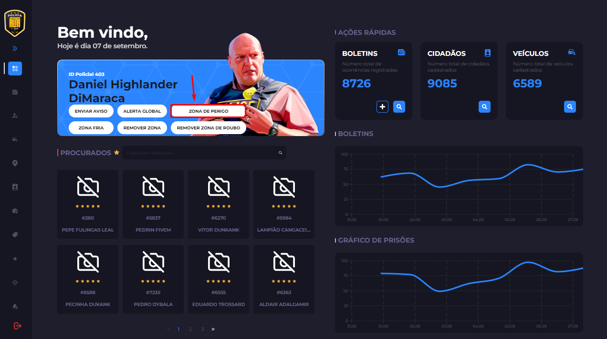
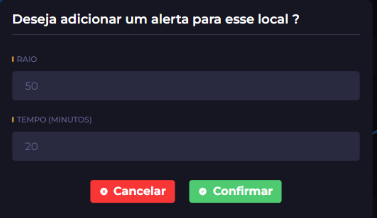
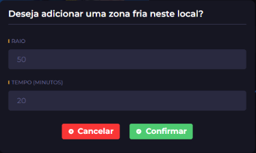

# Zonas de Perigo

É obrigatório informar a população sempre que determinada área da cidade estiver sob atividade criminosa. Para isso, deverá ser utilizado o menu "ZONA DE PERIGO" no tablet em todas as ocorrências de ações blipadas e Código 5.\
Em uma zona de perigo, qualquer movimentação dentro dela deverá ser classificada como suspeita.\
Sempre que alguém entrar dentro de uma, deverá ser solicitado que se retire, e caso ocorra uma reincidencia, a força deverá ser escalonada, geralmente, Quando em veiculos:\
\
1 - Disparos de Aviso\
2 - Disparos nos pneus\
3 - Disparos letais\
\
Em indivíduos que estejam a pé, a algema/taser deverá ser sempre priorizada antes de utilizar meios letais para imobilização.

<figure><figcaption></figcaption></figure>

Ao clicar em "ZONA DE PERIGO" aparecerá uma outra caixa para preenchimento:

<figure><figcaption></figcaption></figure>

<mark style="color:$primary;">"Raio"</mark> é o tamanho da zona que você deseja abrir. Em média, o tamanho é de 150 Metros mas depende da situação necessária, podendo ser mais ou menos.

<mark style="color:$success;">"Tempo"</mark> é o tempo em que ela ficará demarcada.

## <mark style="color:red;">AÇÕES</mark>

Todas as ações conhecidas como blipadas tem seu perímetro já prédefinido pelo servidor sempre que o roubo for iniciado, exceto Ammunation e Loja de Bebidas. Neste caso deverá ser aberto uma zona de perigo menor que preencha apenas o local do roubo em questão.

<table data-view="cards"><thead><tr><th></th><th data-hidden data-card-cover data-type="image">Cover image</th></tr></thead><tbody><tr><td>Exemplo de perimetro prédefinido</td><td><a href="../../.gitbook/assets/Screenshot_64.png">Screenshot_64.png</a></td></tr><tr><td>Exemplo de perimetro para roubos pequenos</td><td><a href="../../.gitbook/assets/Screenshot_66.png">Screenshot_66.png</a></td></tr></tbody></table>

## <mark style="color:blue;">ZONA FRIA</mark>

A Zona Fria é considerada uma zona de perigo pacificada, e por tanto, sem a necessidade de hostilidade. Ela deverá ser utilizada para organizar a ocorrência e delimitar a área de atuação policial, garantindo maior controle e organização após a neutralização de todos os hostis na área;\
A existência de uma Zona Fria não significa que todas as pessoas que circularem pela área sejam suspeitas. O policial deverá agir com discernimento, evitando abordagens ou acusações sem que exista uma justificativa relacionada à ocorrência.\
Pórem, jamais deve-se abaixar a guarda dentro de uma zona fria, estando sempre com atenção e cautela até a finalização da ocorrência.
\
Toda zona fria deverá ser anunciada 5 minutos antes de começar através do /911 e deverá começar sempre 5 minutos depois de que seja confirmada que todas as ameaças foram neutralizadas. Toda QRU de código 5 deverá ter a espera de 5 minutos para o início da zona fria independente da quantidade de indivíduos envolvidos.
\
Ex: /911 - Zona Fria | Estacionamento Vermelho | Inicio ás 20:30hrs. 

<figure><figcaption></figcaption></figure>

É necessário que a zona fria seja sempre do mesmo tamanho da zona de perigo para manter a delimitação da ocorrência e realização dos procedimentos necessários para a finalização.

